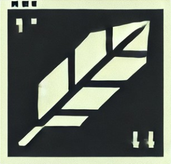

# Note Sage

<p align="center">
  
</p>

A simple yet powerful **Terminal User Interface (TUI)** and **Command-Line Interface (CLI)** note-taking app written in Rust. Manage your tasks with ease, featuring tags, due dates, priorities, and more. Fully customizable via Lua configuration!


---

## Features

- **TUI and CLI Support**: Use it interactively in the terminal or via commands.
- **Vim-like Navigation**:
  - `j` / `k`: Move down/up.
  - `h` / `l`: Switch between Active and Archived tabs.
- **Task Management**:
  - `a`: Add a new task.
  - `d`: Delete a task.
  - `D`: Mark a task as done.
  - `r`: Archive completed tasks.
- **Undo Functionality**: Accidentally deleted a task? Don’t worry, undo is here!
- **Customizable UI**:
  - Configure colors, keybindings, and behavior using a Lua config file.
- **Open Source**: MIT Licensed. Feel free to contribute or build your own features!
- **Future Plans**:
  - Google Drive sync.
  - More integrations (e.g., CalDAV, Todo.txt).

---

## Installation

### Prerequisites
- Rust (install via [rustup](https://rustup.rs/))

### Build from Source
1. Clone the repository:
   ```bash
   git clone https://github.com/zpeteman/todo_sage.git
   cd todo_sage
   ```
2. Build the project:
    ``` bash
    cargo build --release
    ```
3. run the app:
    ```bash
    ./target/release/todoSage
    ```
---

### Usage
#### TUI Mode

Launch the app without arguments to enter TUI mode:

```bash
notesage
```

#### CLI Mode

use the app from command line.

```bash
noteSage add "Buy groceries" --tags "shopping" --due "2024-12-31" --priority high 
noteSage list                                                                     
noteSage delete --id 1                                                            
```

there is more functions use help to see all of them.

---
### Configuration
Customize the app using a Lua config file (~/.config/noteSage/config.lua). Here’s an example:

```lua
return {                                        
    ui = {                                      
        colors = {                              
            primary = "#3498db", -- Blue        
            warning = "#f39c12", -- Orange      
            error = "#e74c3c",   -- Red         
            background = "#34495e" -- Dark blue 
        }                                       
    },                                          
    keybindings = {                             
        quit = "q",                             
        new_task = "a",                         
        mark_done = "D",                        
        delete_task = "d",                      
        archive_tasks = "r",                    
        navigate_up = "k",                      
        navigate_down = "j",                    
        switch_tab_left = "h",                  
        switch_tab_right = "l"                  
    }
}
```
---
### Contributing

This project is open source, and contributions are welcome! If you have an idea for a new feature or find a bug, please open an issue or submit a pull request.

---
### Licence

This project is licensed under the MIT License. See the LICENSE file for details.

---
### Issues and Support

If you encounter any issues or have questions, please open an issue on GitHub. You can also reach out to me on X (formerly Twitter) @the_zanan.

---
### Acknowledgments
 -  Built with Ratatui for the TUI.
 - Inspired by task management tools like Taskwarrior and Todo.txt.
